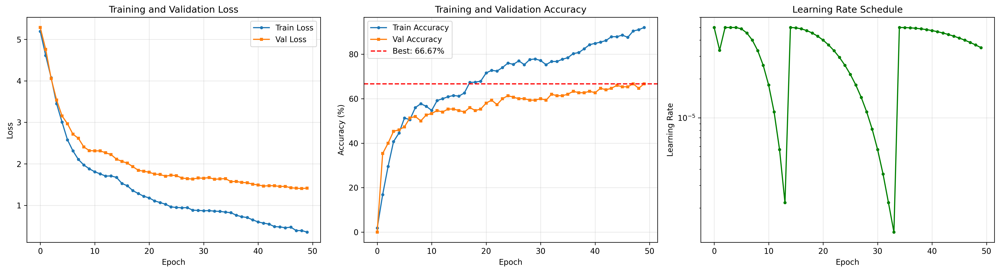
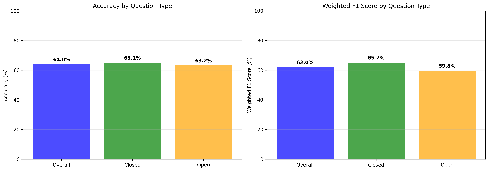

# Authors: Haziq Faiz, Koh Chung How

# Medical Visual Question Answering (VQA) Benchmark of BiomedCLIP vs SAN

A deep learning system for answering medical questions about radiological images using BiomedCLIP as a feature extractor and a trainable MLP classifier.

## 🔍 Overview

This project implements a Medical Visual Question Answering system that can answer questions about medical images (X-rays, CT scans, MRI scans, etc.). The system uses:

- **BiomedCLIP**: A vision-language model pre-trained on 15M biomedical image-text pairs
- **Trainable MLP Classifier**: A lightweight classification head for answer prediction
- **SLAKE Dataset**: A comprehensive medical VQA dataset with English questions

## 🏗️ BioMedClip-MLP Architecture

```
┌─────────────────────────────────────────────────────────────┐
│                      Input Layer                            │
├──────────────────────┬──────────────────────────────────────┤
│   Medical Image      │        Question Text                 │
│   (3×224×224)        │        (Variable length)             │
└──────────┬───────────┴────────────────┬─────────────────────┘
           │                            │
           ▼                            ▼
    ┌─────────────┐            ┌─────────────────┐
    │  BiomedCLIP │            │   BiomedCLIP    │
    │   Vision    │            │  Text Encoder   │
    │   Encoder   │            │  (PubMedBERT)   │
    │  (ViT-B/16) │            │                 │
    └──────┬──────┘            └────────┬────────┘
           │                            │
           │  512-dim                   │  512-dim
           │  (frozen)                  │  (frozen)
           ▼                            ▼
    ┌─────────────┐            ┌─────────────────┐
    │   Vision    │            │      Text       │
    │ Projection  │            │   Projection    │
    │  512→512    │            │    512→512      │
    └──────┬──────┘            └────────┬────────┘
           │                            │
           └────────────┬───────────────┘
                        ▼
                 ┌─────────────┐
                 │    Concat   │
                 │  Fusion     │
                 │  1024-dim   │
                 └──────┬──────┘
                        │
                        ▼
              ┌──────────────────┐
              │   MLP Classifier │
              │  (1 hidden layer)│
              │   1024→512→N     │
              └────────┬─────────┘
                       │
                       ▼
                ┌─────────────┐
                │   Softmax   │
                │  (N classes)│
                └─────────────┘
                       │
                       ▼
                  Answer
```

### Model Components

| Component | Details | Parameters |
|-----------|---------|------------|
| **Vision Encoder** | BiomedCLIP ViT-B/16 | ~86M (frozen) |
| **Text Encoder** | BiomedCLIP PubMedBERT | ~110M (frozen) |
| **Vision Projection** | Linear 512→512 | ~262k (trainable) |
| **Text Projection** | Linear 512→512 | ~262k (trainable) |
| **Classifier** | 1024→512→N classes | ~525k (trainable) |
| **Total** | ~197M | ~1.05M trainable |

## 📊 Dataset

### SLAKE Dataset

[SLAKE](https://www.med-vqa.com/slake/) is a bilingual medical VQA dataset with:

- **Images**: 642 radiological images (CT, MRI, X-ray)
- **Questions**: ~15,000 question-answer pairs
- **Languages**: English and Chinese (we use English only)
- **Question Types**:
  - **Closed**: Yes/No, multiple choice (~60%)
  - **Open**: Free-form answers (~40%)

### Download Instructions

1. Visit [https://www.med-vqa.com/slake/](https://www.med-vqa.com/slake/)
2. Download the dataset
3. Extract to a directory (e.g., `./SLAKE`)

Expected structure:
```
SLAKE/
├── imgs/
│   ├── xmlab0/
│   │   └── source.jpg
│   ├── xmlab1/
│   │   └── source.jpg
│   └── ...
└── train.json
```

## 🚀 Installation

### Requirements

- Python 3.8+
- CUDA-capable GPU (recommended)
- 8GB+ GPU memory

### Setup

```bash
# Clone the repository
git clone https://github.com/yourusername/medical-vqa-biomedclip.git
cd medical-vqa-biomedclip

# Create virtual environment
python -m venv venv
source venv/bin/activate  # On Windows: venv\Scripts\activate

# Install dependencies
pip install -r requirements.txt
```

## 📊 Results

### Training Curves



### Question Type Performance



### Sample Predictions

| Image | Question | True Answer | Prediction | Confidence |
|-------|----------|-------------|------------|------------|
| CT scan | What plane is this? | axial | axial | 92.3% |
| X-ray | Is this a normal chest X-ray? | no | no | 87.5% |
| MRI | What organ is shown? | brain | brain | 94.1% |


### Related Papers

**BiomedCLIP**:
```bibtex
@article{zhang2023biomedclip,
  title={BiomedCLIP: A Multimodal Biomedical Foundation Model Pretrained from Fifteen Million Scientific Image-Text Pairs},
  author={Zhang, Sheng and others},
  journal={arXiv preprint arXiv:2303.00915},
  year={2023}
}
```

**SLAKE Dataset**:
```bibtex
@article{liu2021slake,
  title={SLAKE: A Semantically-Labeled Knowledge-Enhanced Dataset for Medical Visual Question Answering},
  author={Liu, Bo and others},
  journal={IEEE ISBI},
  year={2021}
}
```

